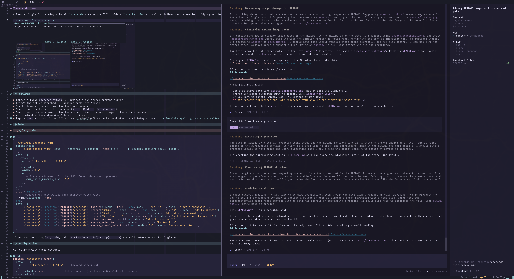

# opencode.nvim

**Requires OpenCode v2 (tested with 2.0.1).** This is a breaking migration from
v1; existing Neovim commands remain, but the CLI, TUI registration, and event
contracts change. Read the [migration guide](docs/opencode-v2-compatibility.md)
before updating. Pin `aa2a146` if you still need v1.

A Neovim plugin for running a local [opencode](https://github.com/anomalyco/opencode) attach-mode TUI inside a [snacks.nvim](https://github.com/folke/snacks.nvim) terminal, with Neovim-side session bridging and local integrations.



[Watch the review queue demo](https://github.com/user-attachments/assets/ad378562-14bb-4525-ae66-711d5da826e0)

## Features

- Launch a local `opencode --server` TUI against a configured backend server
- Bridge the active attached TUI session back into Neovim
- Share the active Neovim file or visual selection with OpenCode's native editor-context integration
- Snacks terminal integration for an embedded OpenCode TUI pane
- Send prompts with context expansion (`@this`, `@buffer`, `@diagnostics`)
- Send direct review comments for the current line or visual range to the active session
- Queue multiple review comments in quickfix and send them as one direct backend request
- Auto-reload buffers when OpenCode edits files
- Expose `User` autocmds for notifications, statusline/tmux hooks, and other local integrations

## Setup

### [lazy.nvim](https://github.com/folke/lazy.nvim)

```lua
{
  "krmcbride/opencode.nvim",
  dependencies = {
    { "folke/snacks.nvim", opts = { terminal = { enabled = true } } },
  },
  opts = {
    server = {
      url = "http://127.0.0.1:4096",
    },
    terminal = {
      layout = "split",
      width = 0.43,
      env = {
        -- Extra environment for the child `opencode --server` process
        SOME_CHILD_PROCESS_FLAG = "1",
        -- Disables OpenTUI's Kitty graphics probe so it does not leak raw
        -- probe text into the embedded Snacks terminal buffer.
        OPENTUI_GRAPHICS = "0",
      },
    },
  },
  init = function()
    -- Required for auto-reload when opencode edits files
    vim.o.autoread = true
  end,
  keys = {
    { "<leader>ac", function() require("opencode").start({ focus = true, continue = true }) end, mode = { "n", "t" }, desc = "Continue opencode" },
    { "<leader>an", function() require("opencode").start({ focus = true, continue = false }) end, mode = { "n", "t" }, desc = "New opencode session" },
    { "<leader>at", function() require("opencode").start({ focus = true, continue = true, layout = "tab" }) end, mode = { "n", "t" }, desc = "Open opencode tab" },
    { "<leader>aa", function() require("opencode").mention_selection({ focus = true }) end, mode = { "n", "x" }, desc = "Native mention selection" },
    { "<leader>aA", function() require("opencode").prompt("@this", { focus = true }) end, mode = { "n", "x" }, desc = "Append selection to prompt" },
    { "<leader>ab", function() require("opencode").prompt("@buffer", { focus = true }) end, desc = "Add buffer to prompt" },
    { "<leader>ad", function() require("opencode").prompt("@diagnostics", { focus = true }) end, desc = "Add diagnostics to prompt" },
    { "<leader>as", function() require("opencode").attach_session_prompt() end, desc = "Attach session ID" },
    { "<leader>av", function() require("opencode").review_selection() end, mode = "n", desc = "Review line" },
    { "<leader>av", function() require("opencode").review_visual_selection() end, mode = "x", desc = "Review selection" },
    { "<leader>ao", function() require("opencode").open_review_queue() end, desc = "Open review queue" },
    { "<leader>ae", function() require("opencode").edit_review_queue_comment() end, desc = "Edit queued review comment" },
    { "<leader>aD", function() require("opencode").delete_review_queue_comment() end, desc = "Delete queued review comment" },
    { "<leader>ap", function() require("opencode").send_review_queue() end, desc = "Send review queue" },
    { "<leader>aP", function() require("opencode").clear_review_queue() end, desc = "Clear review queue" },
  },
}
```

If you are not using `lazy.nvim`, call `require("opencode").setup({ ... })` yourself before using the plugin API.

## Configuration

All options with their defaults:

```lua
require("opencode").setup({
  server = {
    url = "http://127.0.0.1:4096", -- Backend server URL
  },
  auto_reload = true,          -- Check unmodified project buffers after edits/runs/reconnects
  review = {
    delivery = "queue",        -- While busy: "queue" for the next run, "steer" for the current run
  },
  editor_context = {
    enabled = true,            -- Share active Neovim file/selection with the embedded OpenCode TUI
  },
  review_queue = {
    signs = {
      enabled = true,          -- Show sign-column markers for queued review comments
      text = "󰅺",              -- Sign text; override with another glyph if desired
      hl = "OpencodeReviewQueueSign",
      priority = 20,
    },
  },
  terminal = {
    cmd = nil,                -- Optional custom attach command
    dir = ".",               -- Positional TUI directory (made absolute at launch)
    continue = true,          -- Default launch behavior; `start` can override per call
    layout = "split",         -- "split" for a right pane, "tab" for a dedicated Neovim tab
    width = 0.35,
    env = nil,
  },
})
```

> **`terminal.env` note:** `opts.terminal.env` is only passed to the child `opencode --server` process. Backend/server feature flags usually need to be configured on the backend server process itself, not here.
> **Editor context note:** `editor_context.enabled = true` starts a localhost WebSocket server lazily when the embedded TUI starts and injects `OPENCODE_EDITOR_SSE_PORT` into that TUI process. The long-running OpenCode backend server is not involved. If `terminal.env.OPENCODE_EDITOR_SSE_PORT` is already set, that explicit value is left untouched. To keep OpenCode's native integration from accidentally using an inherited Claude Code bridge, `CLAUDE_CODE_SSE_PORT` is cleared in the child TUI env and a warning is shown if a non-empty value is detected.
> **Embedded terminal note:** `opencode.nvim` runs the OpenCode TUI in a Snacks terminal. Neovim's embedded terminal does not support Kitty graphics, so setting `OPENTUI_GRAPHICS = "0"` under `opts.terminal.env` is recommended to avoid stray raw text like `Gi=31337,s=1,v=1,a=q,t=d,f=24;AAAA` appearing in the terminal buffer.
> **Auto-reload note:** set `vim.o.autoread = true`. V2 does not emit every file edit yet, so the plugin coalesces disk checks after file, tool, shell, execution, and reconnect events, and when returning to the editor. Only loaded, unmodified buffers in the active location are reloaded.
> **Auth note:** backend auth is read from Neovim's `OPENCODE_PASSWORD`, with `OPENCODE_SERVER_PASSWORD` as a fallback. V2 uses the fixed username `opencode`. The same password is passed to the TUI; credentials belong in Neovim's environment, not only in `terminal.env`. If you source credentials from a file or secret manager, populate `vim.env` before calling `require("opencode").setup(...)`.
> **Width:** Set terminal width with `opts.terminal.width`.
> Other terminal behavior uses plugin defaults.

### OpenCode TUI Plugin

To track the visible TUI session, register this repository in OpenCode v2's
`cli.json` (normally `~/.config/opencode/cli.json`):

```json
{
  "$schema": "https://opencode.ai/v2/cli.json",
  "plugins": ["/absolute/path/to/opencode.nvim"],
  "prompt": { "editor": true }
}
```

For `lazy.nvim`, use the **absolute** path to its `opencode.nvim` directory.
V2 does not interpolate `{env:HOME}` or expand `~` in this list. Keep `cli.json`
writable: OpenCode also saves UI preferences there. If you manage configuration
declaratively, seed the file once or manage a writable copy.

The root `tui.ts` entrypoint loads the native TUI bridge definition.
The plugin id remains `opencode-nvim-bridge`. It is inert when launched outside
Neovim. End users do not need to run `bun install`; the SDK dependencies are only
used for development typechecking. Restart the embedded TUI after registering the bridge.

## API

### Terminal Control

```lua
require("opencode").start()                  -- Start opencode if not running
require("opencode").start({ focus = true })  -- Start and focus if a new terminal is opened
require("opencode").start({ continue = true, focus = true }) -- Open with `--continue`, no-op if already open
require("opencode").start({ continue = false }) -- Open without `--continue`, no-op if already open
require("opencode").start({ continue = false, focus = true }) -- Open without `--continue`, no-op if already open
require("opencode").start({ layout = "tab", focus = true }) -- Open in a dedicated Neovim tab
require("opencode").attach_session("ses_...") -- Attach directly to a specific session id
require("opencode").attach_session_prompt()   -- Prompt for a session id, then attach
require("opencode").status()                 -- Show terminal, backend, bridge, and SSE status
```

The embedded terminal maps `gf` and `gF` over file references in OpenCode output.
`gF` jumps to the referenced line, and line ranges such as `path#10-20` or
`path:10-20` briefly highlight the referenced range. The range flash uses the
`OpencodeFileReferenceRange` highlight group, which defaults to `Visual` and can
be overridden from your Neovim config:

```lua
vim.api.nvim_set_hl(0, "OpencodeFileReferenceRange", {
  bg = "#3b4261",
})
```

### Prompts

```lua
-- Insert the current line or selection through OpenCode's native editor integration.
require("opencode").mention_selection({ focus = true })

-- Add context through prompt appending (build up context, then submit in TUI).
require("opencode").prompt("@this")         -- Current line or selection, legacy append path
require("opencode").prompt("@buffer")       -- Current file
require("opencode").prompt("@diagnostics")  -- LSP diagnostics

-- Focus the terminal after adding context
require("opencode").prompt("@this", { focus = true })

-- Or submit immediately
require("opencode").prompt("Fix @diagnostics", { submit = true })
require("opencode").prompt("Explain this", { clear = true, submit = true })
```

**Prompt Options:**

| Option | Type | Description |
| :------- | :------ | :------------------------------------------------------------------------------------------------------ |
| `clear` | boolean | Clear the TUI input before appending |
| `submit` | boolean | Submit the TUI input after appending |
| `focus` | boolean | Focus the terminal after append; also enters Terminal mode and moves the cursor to EOL (see note below) |

> **`focus` behavior:** OpenCode’s `@` picker expects the cursor at the end of an `@path` fragment. With `focus = true`, the plugin focuses the snacks terminal, switches to Terminal mode, then jumps to the end of the prompt so appended refs match that expectation.

**Native Mentions vs Prompt Appending:**

`mention_selection()` uses OpenCode's native editor-context WebSocket and sends an `at_mentioned` notification directly to the embedded TUI. This is the preferred path for current-line and visual-range mentions because it creates the TUI file mention without writing text through the terminal PTY or relying on autocomplete focus behavior.

`prompt("@this")`, `prompt("@buffer")`, and `prompt("@diagnostics")` use opencode.nvim's older prompt-append path. Keep this path for whole-buffer mentions, diagnostics, directory/file refs from pickers, and other text-based prompt composition. `mention_selection()` falls back to `prompt("@this")` if the embedded TUI has not connected to the editor-context WebSocket yet, unless called with `{ fallback = false }`.

**Context Placeholders:**

These placeholders are defined by `opencode.nvim`, not by OpenCode itself. The plugin expands them into plain prompt text and native OpenCode-style file references before sending the prompt to the attached TUI/backend.

They only work when prompt text flows through `opencode.nvim` APIs like `require("opencode").prompt(...)` or mappings built on top of those APIs. Typing `@this`, `@buffer`, or `@diagnostics` directly into the OpenCode TUI does not trigger any special expansion.

| Placeholder | Expands To | Description |
| :------------- | :------------------------------------------------------------------- | :--------------------------------------------------------------------------------------------------------- |
| `@this` | `@file.lua#21`, `@file.lua#21-30`, or `columns 8-15 in @file.lua#21` | Current line, line range, or single-line char selection (columns as text; `@…#` last for TUI autocomplete) |
| `@buffer` | `@file.lua` | Current buffer path |
| `@diagnostics` | Prompt text with a formatted diagnostic list and trailing `@file` ref | LSP diagnostics for current buffer |

> **Tip:** `@this` expands to a native OpenCode file reference like `@file.lua#21` or `@file.lua#21-30`. With `focus = true`, `opencode.nvim` leaves the TUI cursor at end-of-line so the attached TUI can continue native `@` completion from that ref. Add a trailing space only if you explicitly want to dismiss the picker; the space is sent literally.

### Reviews

```lua
-- Review the current line with one composer that can queue or send.
require("opencode").review_selection()

-- Review the current visual range with one composer that can queue or send.
require("opencode").review_visual_selection()

-- Queue-only compatibility entrypoints.
require("opencode").queue_review_selection()
require("opencode").queue_review_visual_selection()

-- Inspect, send, or clear the queued comments.
require("opencode").open_review_queue()
require("opencode").edit_review_queue_comment()
require("opencode").delete_review_queue_comment()
require("opencode").send_review_queue()
require("opencode").clear_review_queue()
require("opencode").review_queue_count()
```

Reviews use `POST /api/session/<sessionID>/prompt` with native `text`, `files`,
and `delivery`. File URIs preserve one-based inclusive `?start=N&end=M` ranges.

The review popup is a small cursor-anchored editor float:

- `Ctrl-S` queues the comment in normal or insert mode
- `Ctrl-Enter` sends the comment immediately in normal or insert mode
- `Ctrl-C` cancels in insert mode
- `q` cancels in normal mode
- `Enter` inserts a newline

The server uses the session's current agent/model/variant; reviews do not infer
these from old messages or change them. `review.delivery = "queue"` (the default)
admits feedback for the next run when busy. Set it to `"steer"` to deliver feedback
to the running agent. Neither option automatically submits comments from the
local Neovim review queue.

A successful send means the server durably accepted the input, **not** that the
agent finished. Queued comments clear only after a valid admission acknowledgement;
comments added or edited during the request remain. Failed or uncertain requests
are never retried automatically. If receipt is uncertain, inspect the TUI before
manually sending again to avoid duplicate feedback.

Queued reviews use the same popup and selection behavior. The queue is process-local and is not persisted across Neovim restarts. Quickfix is only a projection for navigation and source previews; the plugin keeps the actual queue state internally. bqf is optional, but it makes the quickfix queue easier to browse. Loaded buffers also show a sign-column marker on lines with queued comments. For loaded buffers, queued ranges are tracked with Neovim extmarks so quickfix, signs, and sends follow line shifts from edits above the queued range; if those marks are unavailable, the plugin falls back to the originally queued line numbers.

The queue sign defaults to `󰅺` using the `OpencodeReviewQueueSign` highlight group, which links to `DiagnosticWarn` by default. The default marker is a Nerd Font glyph; if your font does not render it, override `review_queue.signs.text` with `O`, `◉`, or another sign-column glyph.

Opening the queue with `open_review_queue()` or `:Opencode review-queue-open` refreshes quickfix with one item per queued comment and a flattened one-line summary for multiline comments. Press `e` in that quickfix list to reopen the selected queued comment in the editor popup, anchored on the queued source location when that file is visible. From a source buffer, `edit_review_queue_comment()` edits the queued comment whose sign is on the current cursor line, and `delete_review_queue_comment()` prompts before deleting that current-line comment. In the edit popup, `Ctrl-S` saves the comment back to the queue and `Ctrl-Enter` sends only that queued comment immediately. Sending one comment uses the same native text and ranged attachment as immediate reviews; sending multiple queued comments uses first-person grouping so OpenCode treats each comment as feedback from you, the user. Sent comments clear only after confirmed admission; failed sends leave them intact.

## User Commands

| Command | Description |
| -------------------------------- | --------------------------------------- |
| `:Opencode status` | Show terminal, backend, bridge, and SSE status |
| `:Opencode review-queue-open` | Open the review queue quickfix projection |
| `:Opencode review-queue-edit` | Edit the queued comment on the current cursor line |
| `:Opencode review-queue-delete` | Delete the queued comment on the current cursor line after confirmation |
| `:Opencode review-queue-send` | Send queued review comments to the active session |
| `:Opencode review-queue-clear` | Clear queued review comments |

`status` includes the backend URL, SSE directory, bridge URL, bridged TUI route, and active session so you can verify where events and direct reviews are going.

## Events

`opencode.nvim` exposes three useful integration surfaces:

- `OpencodeEvent:*` for backend SSE events in the active backend location (directory and workspace)
- `OpencodeActiveEvent:*` for local embedded-TUI events scoped to the currently attached session
- `OpencodeSessionChanged` for coarse route/session/cwd changes reported by the embedded TUI

That gives you enough surface to build your own notifications, tmux/workmux or window-status hooks, statusline components, per-session UI state, or any other local automation without hard-coding those integrations into the plugin.

Register these from your normal Neovim config with `vim.api.nvim_create_autocmd("User", ...)` after loading the plugin.

### `OpencodeEvent:*`

`OpencodeEvent:*` comes from the backend SSE stream. This is the right surface for backend file/edit lifecycle events and server connection state.

```lua
vim.api.nvim_create_autocmd("User", {
  pattern = "OpencodeEvent:*",
  callback = function(args)
    local event = args.data.event
    if event.type == "session.execution.succeeded" then
      vim.notify("opencode finished responding")
    end
  end,
})
```

For `OpencodeEvent:*`, `args.data` includes:

- `event`: the backend SSE event object
- `url`: the backend base URL that produced the event
- `directory`, `workspace_id`: the active location used for filtering

### `OpencodeActiveEvent:*`

When the bundled TUI bridge plugin is installed, `opencode.nvim` also forwards the active embedded session's local OpenCode events as autocmds.

This is the most useful surface for integrations that care about the embedded TUI the user is actually looking at, for example:

- desktop notifications when the active session goes idle or errors
- tmux/workmux or window-title status updates while the agent is busy or waiting on a question/permission prompt
- local UI reactions to `form.created` / `permission.asked` without watching every backend event globally

```lua
vim.api.nvim_create_autocmd("User", {
  pattern = "OpencodeActiveEvent:*",
  callback = function(args)
    local event = args.data.event
    if event.type == "session.execution.succeeded" then
      vim.notify("active embedded OpenCode session is idle")
    end
  end,
})
```

`OpencodeActiveEvent:*` comes from the embedded TUI bridge plugin and is scoped to the currently attached session, which makes it suitable for local integrations like notifications, statusline widgets, or tmux/workmux hooks.

Currently forwarded native event types:

- `session.execution.started`, `.succeeded`, `.failed`, `.interrupted`
- `session.retry.scheduled`
- `session.inbox.enqueued`, `.delivered`, `.cancelled`
- `session.agent.selected`, `session.model.selected`
- `permission.asked`, `permission.replied`
- `form.created`, `form.replied`, `form.cancelled`

Payloads use `event.data`, not v1's `event.properties`. Ownership is normally
`event.data.sessionID`; for `form.created` it is `event.data.form.sessionID`.
Events from other sessions (including child sessions) and global forms are not
forwarded as active events. V1 event names are not synthesized.

For `OpencodeActiveEvent:*`, `args.data` includes:

- `event`: the forwarded OpenCode event object
- `route`: the local TUI route when the event was observed
- `session_id`: the local attached session id when available
- `instance_id`: the Neovim bridge instance id
- `cwd`: the native active session directory (or default location on the home route)
- `workspace_id`: the native workspace id, when present

### `OpencodeSessionChanged`

`OpencodeSessionChanged` fires when the local bridge reports that the active embedded TUI route, session id, cwd, or workspace changed.

This is the right surface for integrations that want coarse session-aware state rather than every individual lifecycle event, for example:

- updating a statusline or winbar with the current attached session id
- mirroring the active OpenCode cwd into tmux/window metadata
- maintaining per-session caches keyed by `(instance_id, session_id)`

```lua
vim.api.nvim_create_autocmd("User", {
  pattern = "OpencodeSessionChanged",
  callback = function(args)
    local data = args.data
    vim.notify(("route=%s session=%s cwd=%s"):format(data.route, data.session_id or "none", data.cwd or "none"))
  end,
})
```

For `OpencodeSessionChanged`, `args.data` includes:

- `route`: the local TUI route when the event was observed
- `session_id`: the active embedded OpenCode session id when available
- `instance_id`: the Neovim bridge instance id
- `cwd`: the native active session directory (or default location on the home route)
- `workspace_id`: the native workspace id, when present

### Reconnects and session metadata

The native SSE feed is volatile: disconnected clients miss events. A 45-second
watchdog allows room for its 15-second comment heartbeats. Location filtering
does not affect connection health. After connecting, `OpencodeResync` requests
fresh disk checks, and `OpencodeSessionRefreshed` supplies the active session's
current `Session.Info` as `args.data.session`. These are snapshots, not replayed
completion/permission notifications.

Notification hooks can use the native helper instead of maintaining their own
HTTP requests and authentication:

```lua
require("opencode.client").get_session(session_id, function(err, info)
  if err then return end
  -- info.title, info.parentID, info.agent, info.model, info.location, info.outcome
end)
```

## Development

```sh
nix develop --command bun install --frozen-lockfile
nix develop --command bun run typecheck
nix develop --command bun run test
nix develop --command stylua --check lua plugin tests
```

The tests use a local native HTTP/SSE fixture and headless Neovim. They do not
contact a model or your OpenCode server. The bridge is typechecked against the
published v2 SDK. See the [migration and validation guide](docs/opencode-v2-compatibility.md)
for the separate live-server checks and remaining integration work.

## Acknowledgments

- Originally inspired by [NickvanDyke/opencode.nvim](https://github.com/NickvanDyke/opencode.nvim)
